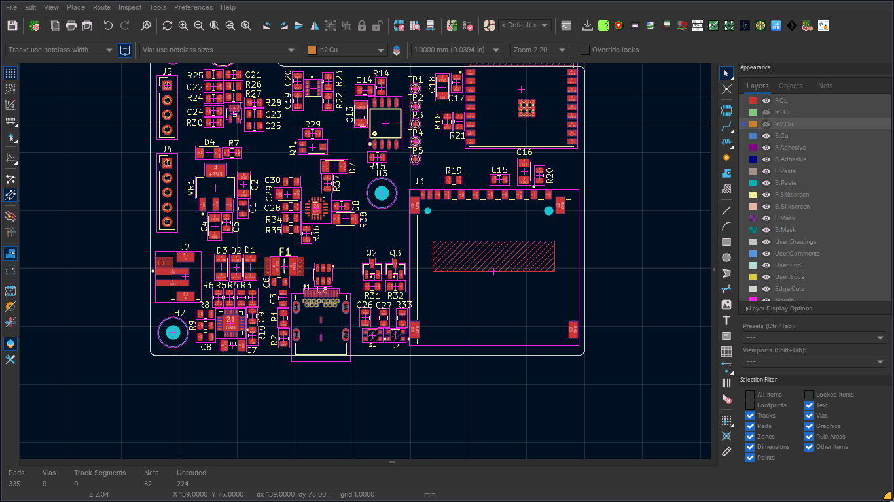
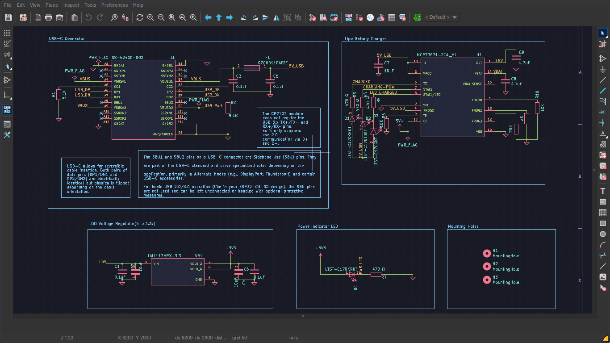

```bash
cat > ~/workspaces/contributions/kicad_contributions/kicad-dark-pro-theme/README.md << 'EOF'
# KiCad Dark Pro Theme

A professional dark gray compact UI theme for KiCad 10 on Linux — cleaner and more compact than Altium Designer's default layout. Includes 16 handcrafted schematic and PCB color themes.

Built and tested on **Arch Linux + Hyprland (Wayland)** with HyDE/wallbash rice management.

---

## Preview

### PCB Layout — Dark Pro UI


### Schematic Sheet — Tokyo Night Theme


---

## Features

- **Pure dark gray UI** — no blue/purple color accents from desktop themes
- **Compact rectangular UI** — no rounded corners, minimal padding on all widgets
- **Scaled at 85% DPI** — smaller toolbars, sidebars, and status bar
- **Scrollable dropdowns** — long lists cap at 300px with scrollbar
- **Bypasses desktop theme enforcement** — works with HyDE/wallbash, Catppuccin, or any GTK theme manager
- **Covers all KiCad tools** — main launcher, PCBnew, Eeschema, GerbView, PCB Calculator, Image Converter
- **16 schematic/PCB color themes** — from Tokyo Night to Altium Midnight Blue

---

## Included Color Themes

| Theme | Style |
|---|---|
| `IBrahim's_Theme` | Custom dark — author's personal theme |
| `tokyo_night` | Dark blue-purple, high contrast |
| `altium_midnight_blue` | Altium-inspired deep blue |
| `altium_soft_slate` | Altium-inspired muted slate |
| `nord_arctic` | Nord palette, cool gray-blue |
| `gruvbox_warm_dark` | Warm retro dark |
| `monokai_vivid` | Vivid Monokai contrast |
| `rose_pine_moon` | Rosé Pine dark variant |
| `pads_dark_navy` | PADS-inspired dark navy |
| `pads_soft_twilight` | PADS-inspired soft twilight |
| `cadence_soft_ember` | Cadence-inspired warm ember |
| `cadence_steel_noir` | Cadence-inspired steel noir |
| `cosmo_deep_jade` | Deep jade green |
| `cosmo_gold` | Rich gold contrast |
| `cosmo_soft_gold` | Soft gold muted |
| `eagle_soft_amber` | Eagle-inspired soft amber |
| `fusion_slate_amber` | Fusion 360-inspired slate amber |

### How to apply a color theme inside KiCad

**Schematic Editor (Eeschema):**
```

Preferences → Preferences → Schematic Editor → Colors → Load Theme

```
Select any `.json` file from the `colors/` folder.

**PCB Editor (PCBnew):**
```

Preferences → Preferences → PCB Editor → Colors → Load Theme

````
Select any `.json` file from the `colors/` folder.

**Or copy themes system-wide:**
```bash
cp colors/*.json ~/.config/kicad/10.0/colors/
````

Themes will then appear in the KiCad color theme dropdown automatically.

---

## Requirements

- KiCad 10.x
- Linux with GTK3
- Wayland compositor (Hyprland, Sway, GNOME Wayland, KDE Wayland)
- `adwaita` GTK theme installed (default on most distros)

---

## Installation

### Automatic

```bash
git clone https://github.com/ibrahimxxxxxxx/kicad-dark-pro-theme.git
cd kicad-dark-pro-theme
chmod +x install.sh
./install.sh
```

The install script:

- Copies all wrappers to `~/.local/bin/`
- Installs desktop entries to `~/.local/share/applications/`
- Backs up existing `gtk.css` and installs the compact version
- Copies all 16 color themes to `~/.config/kicad/10.0/colors/`

### Manual

```bash
# 1. Copy wrappers
cp wrappers/* ~/.local/bin/
chmod +x ~/.local/bin/*-dark

# 2. Copy desktop entries
sed "s|\$HOME|$HOME|g" desktop/org.kicad.kicad.desktop > ~/.local/share/applications/org.kicad.kicad.desktop
sed "s|\$HOME|$HOME|g" desktop/org.kicad.eeschema.desktop > ~/.local/share/applications/org.kicad.eeschema.desktop
sed "s|\$HOME|$HOME|g" desktop/org.kicad.pcbnew.desktop > ~/.local/share/applications/org.kicad.pcbnew.desktop
sed "s|\$HOME|$HOME|g" desktop/org.kicad.gerbview.desktop > ~/.local/share/applications/org.kicad.gerbview.desktop
sed "s|\$HOME|$HOME|g" desktop/org.kicad.pcbcalculator.desktop > ~/.local/share/applications/org.kicad.pcbcalculator.desktop
sed "s|\$HOME|$HOME|g" desktop/org.kicad.bitmap2component.desktop > ~/.local/share/applications/org.kicad.bitmap2component.desktop

# 3. Install GTK CSS
cp ~/.config/gtk-3.0/gtk.css ~/.config/gtk-3.0/gtk.css.bak 2>/dev/null || true
cp gtk/gtk.css ~/.config/gtk-3.0/gtk.css

# 4. Install color themes
mkdir -p ~/.config/kicad/10.0/colors/
cp colors/*.json ~/.config/kicad/10.0/colors/
```

---

## How It Works

### The core problem

On Linux with HyDE, Catppuccin, or any GTK theme manager, KiCad inherits the system GTK theme via `dconf`/`gsettings` at runtime. There is no KiCad setting to override this.

### The fix

Each KiCad tool launches via a wrapper that exports `GTK_THEME=Adwaita:dark` at the **process level**, bypassing `dconf`/`gsettings` entirely.

```bash
export GTK_THEME=Adwaita:dark          # bypass dconf/gsettings
export GTK_APPLICATION_PREFER_DARK_THEME=1
export GDK_BACKEND=wayland             # explicit Wayland backend
export GDK_DPI_SCALE=0.85             # compact UI scaling
```

### What NOT to do

| Approach                                     | Why it fails                                             |
| -------------------------------------------- | -------------------------------------------------------- |
| `gsettings set gtk-theme Adwaita` in wrapper | HyDE/dconf overwrites it at runtime                      |
| `unset GTK_THEME`                            | dconf Catppuccin then wins                               |
| `gtk.css` color overrides                    | Conflicts with Adwaita:dark, re-introduces accent colors |
| Kvantum env vars                             | Ignored at runtime for GTK3 apps                         |
| `userprefs.conf` border override             | HyDE re-applies theme.conf after reload                  |

### GTK CSS scope

The `gtk.css` targets **geometry and padding only** — no color rules. Color rules conflict with `Adwaita:dark` and re-introduce unwanted accent colors.

---

## File Structure

```
kicad-dark-pro-theme/
├── README.md
├── install.sh
├── wrappers/
│   ├── kicad-dark
│   ├── eeschema-dark
│   ├── pcbnew-dark
│   ├── gerbview-dark
│   ├── pcb_calculator-dark
│   └── bitmap2component-dark
├── desktop/
│   ├── org.kicad.kicad.desktop
│   ├── org.kicad.eeschema.desktop
│   ├── org.kicad.pcbnew.desktop
│   ├── org.kicad.gerbview.desktop
│   ├── org.kicad.pcbcalculator.desktop
│   └── org.kicad.bitmap2component.desktop
├── gtk/
│   └── gtk.css
├── colors/
│   ├── IBrahim's_Theme.json
│   ├── tokyo_night.json
│   ├── altium_midnight_blue.json
│   └── ... (16 themes total)
├── theme_snapshots/
│   ├── pcb_theme.png
│   └── tokyo_night_schematic_sheet_theme.png
└── screenshots/
```

---

## Compatibility

| Distro          | Compositor         | Status                                                          |
| --------------- | ------------------ | --------------------------------------------------------------- |
| Arch Linux      | Hyprland (Wayland) | ✅ Tested                                                       |
| Arch Linux      | Sway (Wayland)     | ✅ Should work                                                  |
| Ubuntu / Debian | GNOME Wayland      | ✅ Should work                                                  |
| Any             | X11                | ⚠ Change `GDK_BACKEND=wayland` to `GDK_BACKEND=x11` in wrappers |

---

## KiCad Internal Settings

```
Preferences → Common → User Interface:
  - Toolbar icon size: Small
  - Theme: Dark
```

---

## Panel Workflow (1366×768 and small displays)

Keep all side panels closed by default:

| Panel         | Suggested Hotkey |
| ------------- | ---------------- |
| Appearance    | `A`              |
| Net Inspector | `N`              |
| Search        | `Ctrl+F`         |
| Properties    | `E` (inline)     |

Assign via: `Preferences → Preferences → Hotkeys`

---

## License

MIT — free to use, modify, and distribute.

---

## Author

Ibrahim — Mechatronics Engineer, KiCad PCB Designer
Arch Linux + Hyprland + HyDE
EOF

```

```
